# Data Warehouse – AlfaMaq Manufatura S.A.

Projeto de **Data Warehouse** desenvolvido para a empresa fictícia **AlfaMaq Manufatura S.A.**, com objetivo de consolidar dados de vendas, estoque e produção, permitindo análises estratégicas e relatórios precisos.

---

## 1. Visão Geral do Projeto

- Construção de um **DW em PostgreSQL** executando em Docker.
- Modelagem dimensional em **Star Schema**: dimensões **Produto**, **Cliente**, **Canal**, **Data**; tabela fato **Vendas**.
- Implementação de **ETL completo**, **SCD Tipo 1, 2 e 3** e **índices de performance**.

---

## 2. Modelagem Dimensional


> O Star Schema garante **consultas rápidas e agregações eficientes** para análise de negócios.

---

## 3. Ambiente

- **PostgreSQL** em contêiner Docker, gerenciado via **pgAdmin**.
- Esquema `dw` centralizando todas as tabelas do DW.

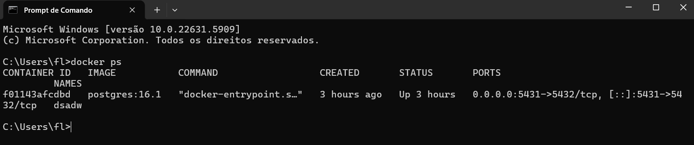

> Contêiner ativo e pronto para execução do DW.

---

## 4. Scripts SQL

Os scripts estão organizados na pasta `scripts/` e numerados para execução sequencial:

| Arquivo | Descrição |
|---------|-----------|
| [`01-cria_container_docker.txt`](./scripts/01-cria_container_docker.txt) | Criação do contêiner Docker com PostgreSQL. |
| [`02-modelo-fisico-projeto1.sql`](./scripts/02-modelo-fisico-projeto1.sql) | Criação do esquema `dw` e tabelas do modelo físico. |
| [`03-processo_etl.sql`](./scripts/03-processo_etl.sql) | Carregamento das dimensões e tabela fato. |
| [`04-relatorios.sql`](./scripts/04-relatorios.sql) | Consultas e views analíticas para relatórios. |
| [`05-indices.sql`](./scripts/05-indices.sql) | Criação de índices para otimização. |
| [`06-SCD-Tipo1.sql`](./scripts/06-SCD-Tipo1.sql) | Exemplo de atualização simples (SCD Tipo 1). |
| [`07-SCD-Tipo2.sql`](./scripts/07-SCD-Tipo2.sql) | Registro de histórico de alterações (SCD Tipo 2). |
| [`08-SCD-Tipo3.sql`](./scripts/08-SCD-Tipo3.sql) | Controle da versão atual e anterior (SCD Tipo 3). |

> Cada script contém comentários explicativos e comandos prontos para execução.

---

## 5. Processo ETL

1. **Dimensões carregadas**: Produto, Cliente, Canal, Data.
2. **Dimensão tempo**: registros históricos cobrindo múltiplos anos.
3. **Tabela fato Vendas**: combinações entre dimensões.

### Prints do carregamento de dados

- Produto: 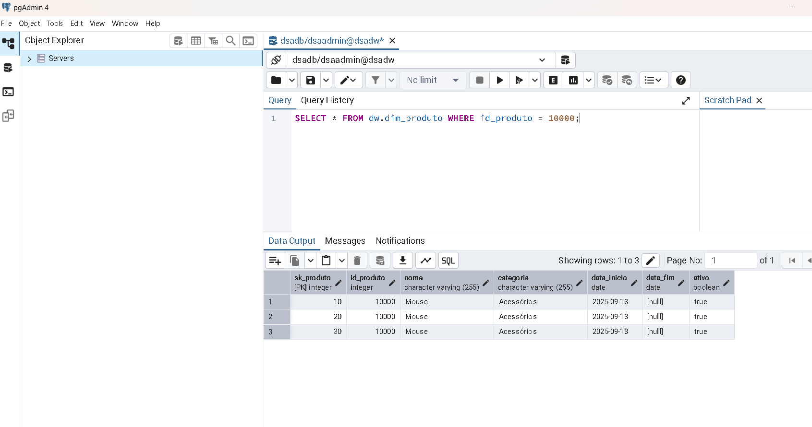
- Cliente: 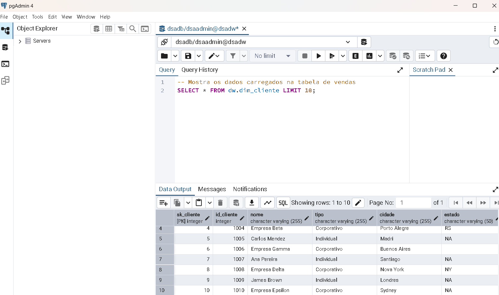
- Canal: 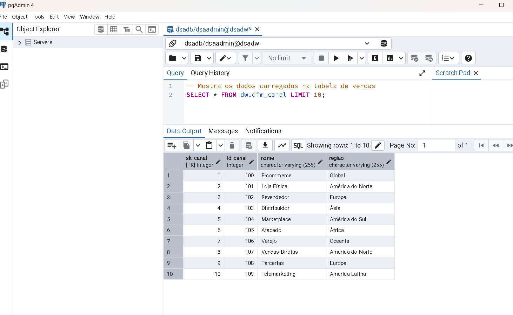
- Data: 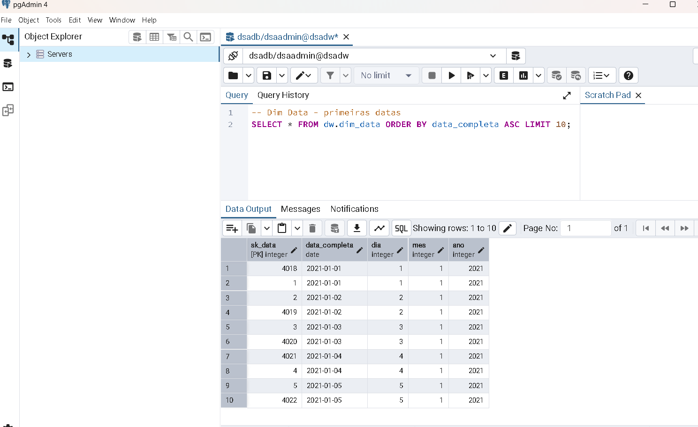
- Fato Vendas: 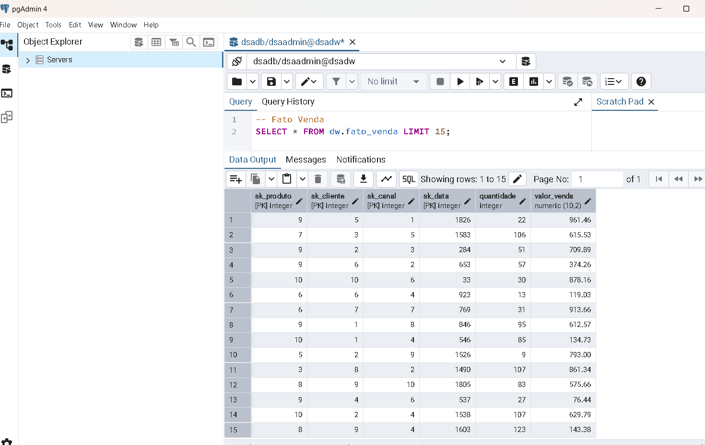

> ETL testado e validado, garantindo **integridade e consistência dos dados**.

---

## 6. Otimização e Relatórios

- Criação de **índices estratégicos** para melhorar performance.
- Consultas analíticas prontas para **relatórios de vendas por produto, cliente e período**.

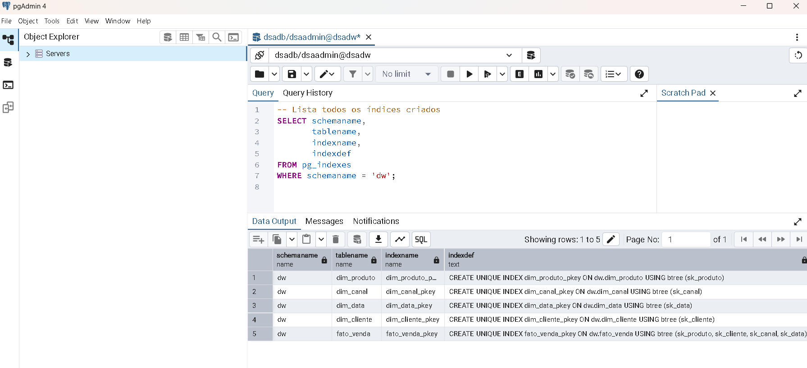
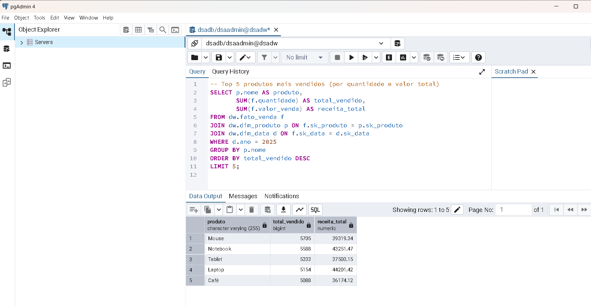

> Performance otimizada mesmo em grandes volumes de dados.

---

## 7. Slowly Changing Dimensions (SCD)

- **Tipo 1**: Atualização simples, sem histórico.
  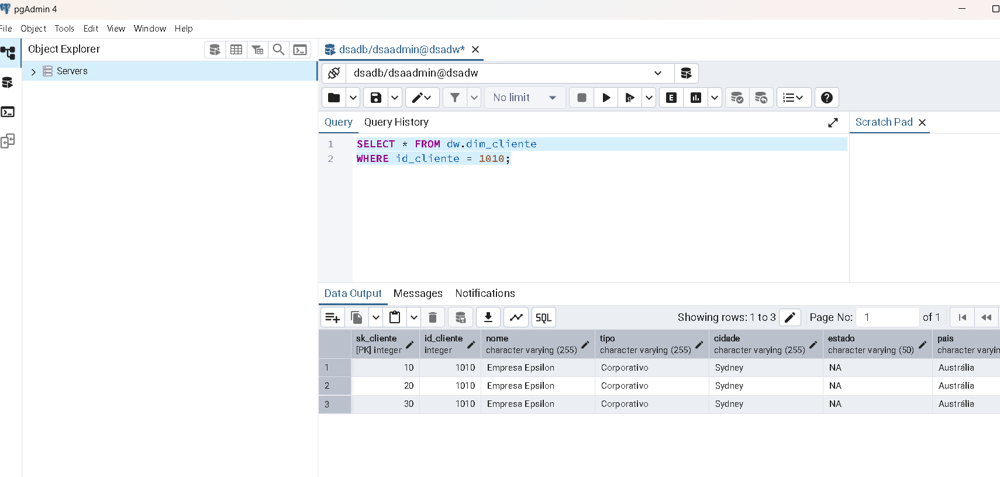
  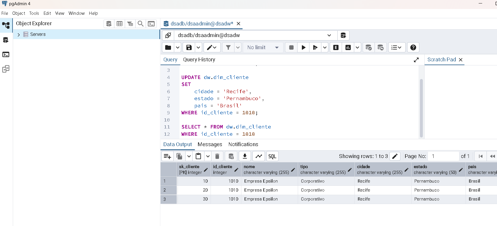

- **Tipo 2**: Histórico completo com registros ativos e inativos.
  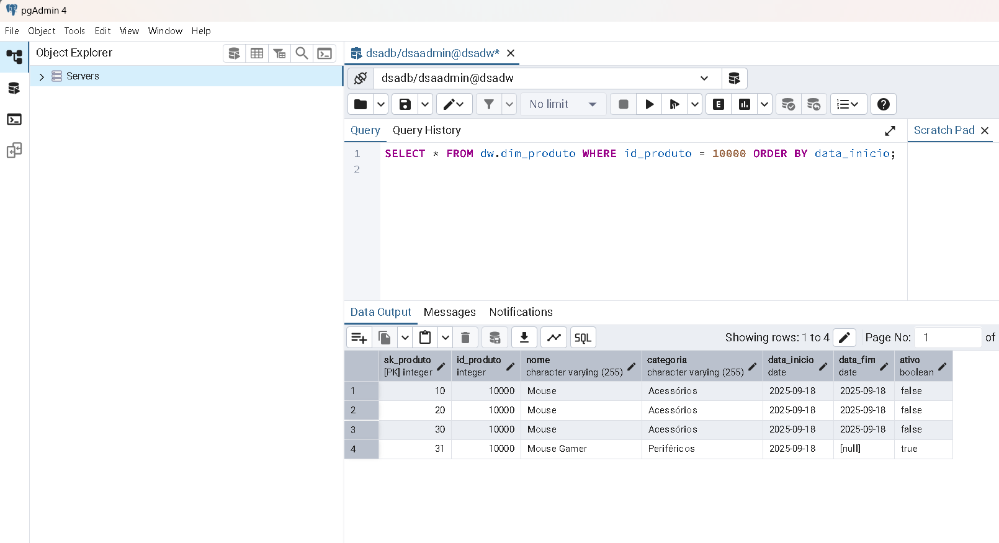

- **Tipo 3**: Apenas versão atual e anterior de um atributo.
  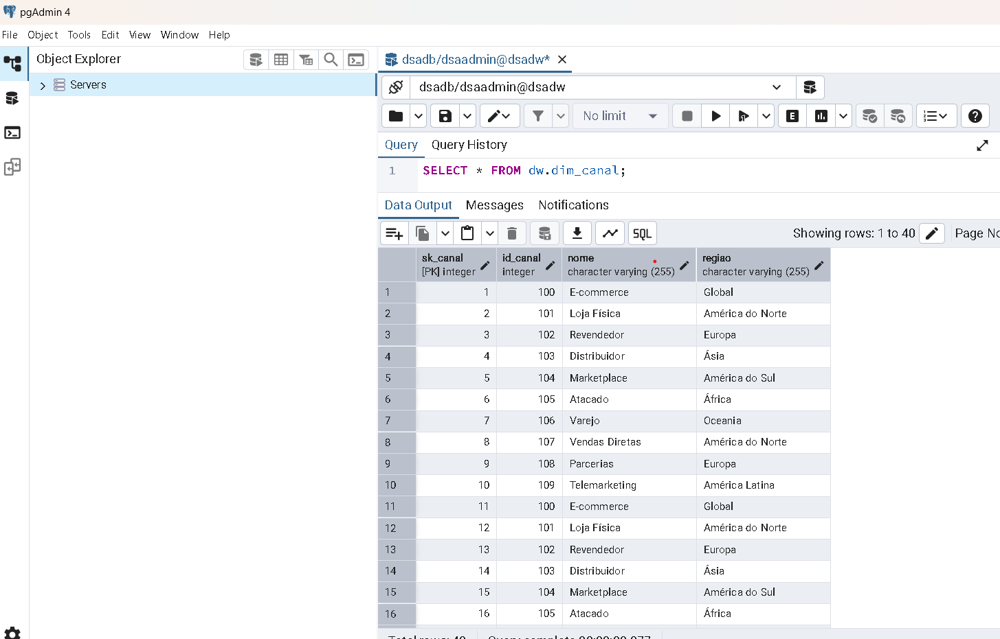
  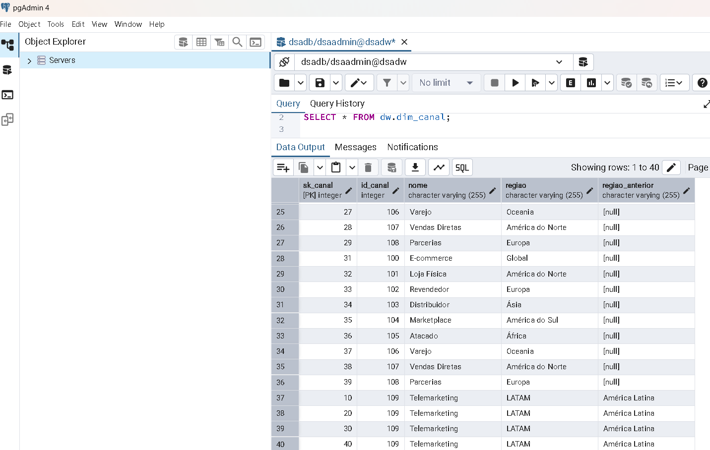

> As SCDs permitem **monitoramento preciso de mudanças nos dados ao longo do tempo**.

---

## 8. Exemplo de Análise de Negócio

> Demonstração prática de uso do DW:

```sql
-- Ranking dos 5 produtos mais vendidos no último ano
SELECT p.nome_produto,
       SUM(f.quantidade) AS total_vendido,
       SUM(f.valor_total) AS receita
FROM dw.fato_vendas f
JOIN dw.dim_produto p ON f.id_produto = p.id_produto
JOIN dw.dim_data d ON f.id_data = d.id_data
WHERE d.ano = 2025
GROUP BY p.nome_produto
ORDER BY total_vendido DESC
LIMIT 5;